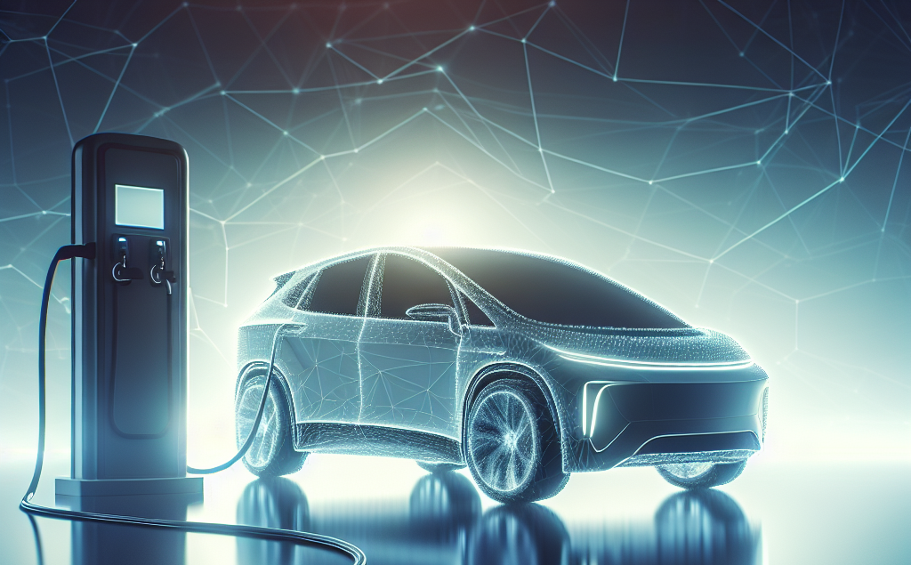

L'ouverture de la COP28 est une bonne occasion pour Saegus de montrer notre engagement dans la valorisation de données appliqué au domaine de la mobilité durable. Dans le passé nous avons accompagné les constructeurs automobile, les équipementiers et les autres acteurs de l'écosystème automobile dans leurs projets data.

Fort de cet experience nous avons le plaisir de vous partager cette analyse des tendances clés dans le domaine de l'infrastructure de recharge des véhicules électriques.

Cette analyse s'appui sur les données publiques hébergés sur la plateforme ouverte des données publiques françaises.