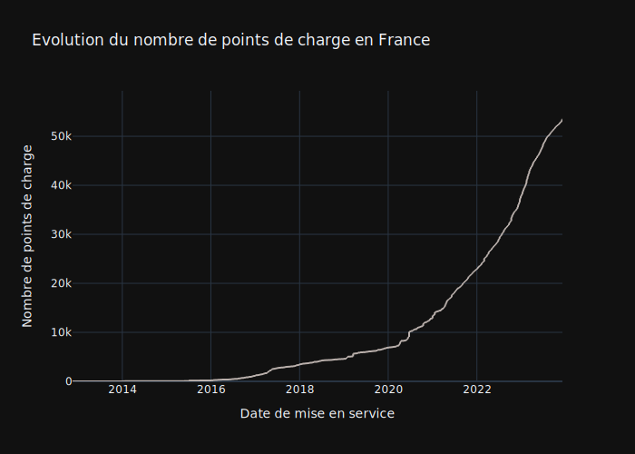

En 2023 un nouveau record de nombre de bornes de recharge disponibles au publique a été [annoncé](https://www.gouvernement.fr/actualite/100-000-bornes-de-recharge-electrique-ouvertes-au-public). Pourtant on ne compte pas autant de bornes documentés dans le dataset publique avec seulement 55% de points de charge listés. La consolidation et referencement de données demandent un effort important. Il est nécessaire de respecter un niveau de qualité de données avant que le dataset soit pris en compte pour la consolidation. Néanmoins les données disponibles permettent d'analyser la dynamique de déploiement d'infrastructure.

Chaque année de plus en plus de bornes sont mis en service. L'année 2022 a été une année record jusqu'ici, sachant que 2023 n'est pas encore fini et que une partie de bornes mises en service n'ont pas encore été répértoriées. Ce qui explique le ralentissement visible en Q3 2023.

Il est notable que la crise de COVID n'a pas pu ralentir le déploiement des installations. L'année 2020 a vu une hausse de 80% de nombre de bornes.

On a la possibilité de voir aussi les jours quand un nombre important de bornes a été déployé en journée. Il s'agit par exemple de SAEMES qui a [ouvert](https://www.auto-infos.fr/article/saemes-et-totalenergies-inaugurent-un-parking-equipe-de-plus-de-500-bornes-de-recharge.248172) en mars 2020 500 bornes. Il peut également s'agir de dates approximatives liés à la publication de données sans que retrouve d'information dans la presse.

Le Gouvernement ambitionne d'atteindre 400 000 points de recharge ouverts au public d'ici à 2030. Nous pouvons ésperer d'avoir encore plus de déploiements dans le futur. 

