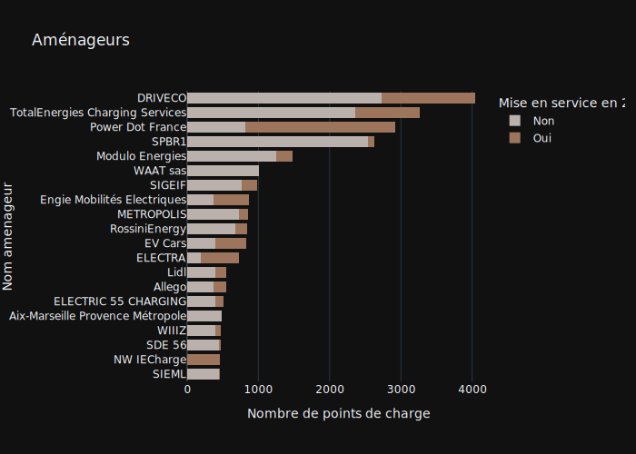

Dans la base de données nous avons la vision par 3 types d'acteurs: 
* Aménageurs - propriétaire des infrastructures.
* Opérateurs - la personne qui exploite l'infrastructure de recharge
* Enseigne - Le nom commercial du réseau.

Si on fait le zoom sur les opérateurs, on se rend compte que seulement 3% de la base de données est composés de petites entités opérant moins de 200 points de charge. C'est un écosystème dominé par les grands comptes.

Si on essaie de visualiser les rélations entre ces 3 types d'acteurs pour les entités qui ont au moins 200 stations à leur disposition on aura la vision suivante.

Plusieurs observations: 
1. La plupart de fois les aménageurs possèdants beaucoup d'infrastructure font appel à un seul opérateur.
2. Certains aménageurs préfèrent de gérer eux-mêmes leur infrastructure, comme c'est le cas pour DriveCo et PowerDot
3. Il existent également les opérateurs généralistes qui adressent une multitude d'aménageurs comme Izivia et SPIE

Cette année on obsèrve un fort developpment de Freshmile et de PowerDot. Avec Freshmile au 1er place des enseignes.

