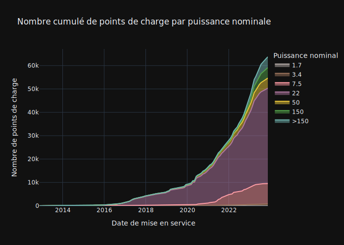
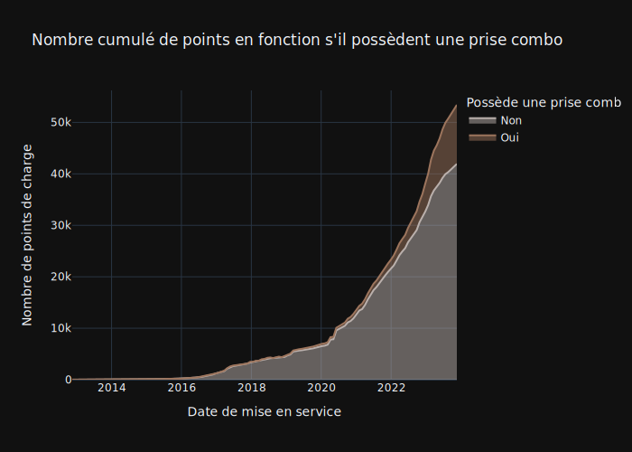
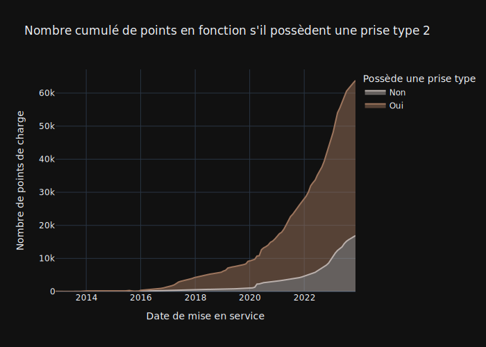

Quels sont les dernières tendences concernant les installations de point de charge? 

Une observation très connue: les voitures possèdent des batteries de plus en plus capacitaires, et elles sont capables d'absorber de plus en plus de puissance. Pour répondre à ce besoin l'infrastructure s'adapte avec le nouveau standard - CCS2 capable de déliverer encore plus de puissance et réduire le temps de charge. L'année 2023 a été une année marqué par le déploiement de cette infrastructure, qu'on obsèrve bien à la fois dans la typologie de bornes et la puissance nominale disponible.

Néanmoins, le standard historique - prise type 2 est encore très présente dans l'infrastructure actuelle. La majorité de bornes sont équipés de cette prise.

