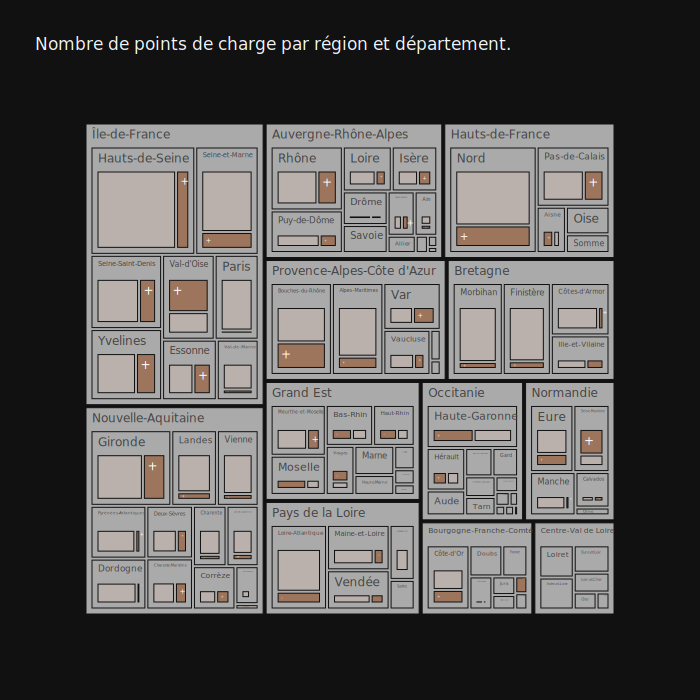
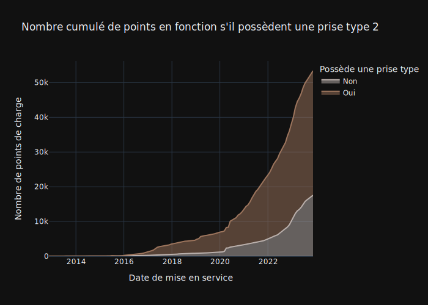

```python
import irve
import importlib
importlib.reload(irve)
from irve import *
```

## Introduction


```python
display(Markdown("1_intro.md"))
```


L'ouverture de la COP28 est une bonne occasion pour Saegus de montrer notre engagement dans la valorisation de données appliqué au domaine de la mobilité durable. Dans le passé nous avons accompagné les constructeurs automobile, les équipementiers et les autres acteurs de l'écosystème automobile dans leurs projets data.

Fort de cet experience nous avons le plaisir de vous partager cette analyse des tendances clés dans le domaine de l'infrastructure de recharge des véhicules électriques.


Cette analyse s'appui sur les données publiques hébergés sur la plateforme ouverte des données publiques françaises.


## Origine et conception des données


```python
display(Markdown("2_data_description.md"))
```


Qui est le fournisseur de ses données et pourquoi publier les données de bornes de recharge? Grace à la [legislation](https://www.legifrance.gouv.fr/jorf/id/JORFTEXT000043475441) c'est devenu une obligation légale.

La reglementation impose de respecter un schema de données précise et de referencer le dataset sur le [site gouvernemental](https://www.data.gouv.fr).

En pratique pour les gestionnaires de point de charge c'est plus avantageux de passer par un intermediaire : une plate-forme d'itinerance où les données sont d'abord cosolidées. En France la plate-forme le plus connue est [Girève](https://www.gireve.com/) qui en plus accompagne ses clients dans la mise en place de diverses services lié à l'écosystème de véhicules électrifiés.

Ce modèle de données inclut des champs spécifiques pour assurer la standardisation des données. Des efforts ont été faits pour valider la qualité et l'uniformité de ces données. Voici quelques-uns des critères de cohérence établis :  
* Chaque borne de recharge (notée PDC pour "point de charge") est unique et correspond à une entrée distincte dans la base de données.
* Un PDC est identifié par un identifiant unique, noté 'id_pdc_itinerance'.  
Chaque PDC est rattaché à une seule station de recharge, identifiée par 'id_station_itinerance'.
* Chaque station est associée à une seule localisation géographique, indiquée par le champ 'coordonneesXY'.  
Ces critères permettent de structurer les informations de manière claire et uniforme, assurant ainsi une meilleure gestion et accessibilité des données sur les infrastructures de recharge pour véhicules électriques.


## Développment de l'infrastructure en France


```python
display(Markdown("3_dev_infra.md"))
```


En 2023 un nouveau record de nombre de bornes de recharge disponibles au publique a été [annoncé](https://www.gouvernement.fr/actualite/100-000-bornes-de-recharge-electrique-ouvertes-au-public). Pourtant on ne compte pas autant de bornes documentés dans le dataset publique avec seulement 55% de points de charge listés. La consolidation et referencement de données demandent un effort important. Il est nécessaire de respecter un niveau de qualité de données avant que le dataset soit pris en compte pour la consolidation. Néanmoins les données disponibles permettent d'analyser la dynamique de déploiement d'infrastructure.


Chaque année de plus en plus de bornes sont mis en service. L'année 2022 a été une année record jusqu'ici, sachant que 2023 n'est pas encore fini et que une partie de bornes mises en service n'ont pas encore été répértoriées. Ce qui explique le ralentissement visible en Q3 2023.

Il est notable que la crise de COVID n'a pas pu ralentir le déploiement des installations. L'année 2020 a vu une hausse de 80% de nombre de bornes.

On a la possibilité de voir aussi les jours quand un nombre important de bornes a été déployé en journée. Il s'agit par exemple de SAEMES qui a [ouvert](https://www.auto-infos.fr/article/saemes-et-totalenergies-inaugurent-un-parking-equipe-de-plus-de-500-bornes-de-recharge.248172) en mars 2020 500 bornes. Il peut également s'agir de dates approximatives liés à la publication de données sans que retrouve d'information dans la presse.

Le Gouvernement ambitionne d'atteindre 400 000 points de recharge ouverts au public d'ici à 2030. Nous pouvons ésperer d'avoir encore plus de déploiements dans le futur. 


## L'écosystème


```python
display(Markdown("4_actors.md"))
```


Dans la base de données nous avons la vision par 3 types d'acteurs: 
* Aménageurs - propriétaire des infrastructures.
* Opérateurs - la personne qui exploite l'infrastructure de recharge
* Enseigne - Le nom commercial du réseau.

On se rend compte que 46% de la base de données sont composés par les petites entités opérant ou possèdant moins de 200 points de charge.

Si on essaie de visualiser les rélations entre ces 3 types d'acteurs pour les 54% restant on arrive à cette vision.


Plusieurs observations: 
1. La plupart de fois les aménageurs possèdants beaucoup d'infrastructure font appel à un seul opérateur.
2. Certains aménageurs préfèrent de gérer eux-mêmes leur infrastructure, comme c'est le cas pour DriveCo et PowerDot
3. Il existent également les opérateurs généralistes qui adressent une multitude d'aménageurs comme Bouygues, Izivia et SPIE

Cette année on obsèrve un fort developpment de Freshmile et de PowerDot. Avec Freshmile au 1er place des enseignes.


Selon la base aujourd'hui c'est DriveCo, Total et PowerDot qui possèdent le plus de bornes.


Quant aux opérateurs, l'image change,  et Bouygues et Izivia qui opèrent les bornes pour les autres aménageurs rejoignent Freshmile déjà cité.


## Vision géographique


```python
display(Markdown("5_geo.md"))
```


La moitié de points de charge ne possèdent pas de géolocalisation vérifié. Malgré le problème de qualité de données on voit bien le groupement de points de charge autour de métropoles et la fameuse [diagonale des faibles densités](https://fr.wikipedia.org/wiki/Diagonale_du_vide)


Le région avec le plus de points de charge est sans surprise IdF, avec Nouvelle-Acquitaine juste après. Certains départements on vu le nombre de bornes doubler au cours de 2023.




## Puissance de l'infrastructure


```python
display(Markdown("6_power.md"))
```


Quels sont les dernières tendences concernant les installations de point de charge? 

Une observation très connue: les voitures possèdent des batteries de plus en plus capacitaires, et elles sont capables d'absorber de plus en plus de puissance. Pour répondre à ce besoin l'infrastructure s'adapte avec le nouveau standard - CCS2 capable de déliverer encore plus de puissance et réduire le temps de charge. L'année 2023 a été une année marqué par le déploiement de cette infrastructure, qu'on obsèrve bien à la fois dans la typologie de bornes et la puissance nominale disponible.


Néanmoins, le standard historique - prise type 2 est encore très présente dans l'infrastructure actuelle. La majorité de bornes sont équipés de cette prise.




